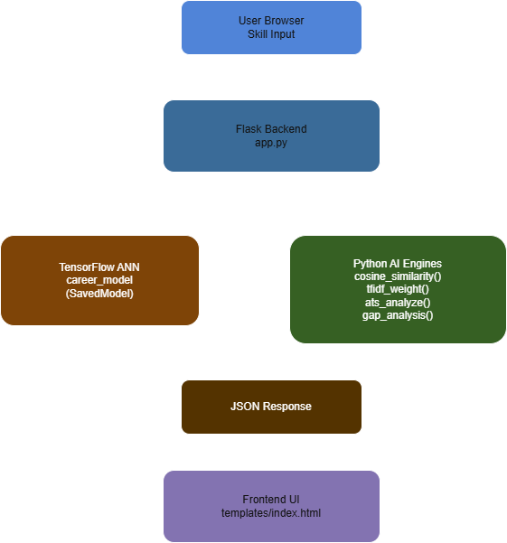

# CareerDNA — NNDL Technical Documentation

Complete explanation of the neural network concepts and AI systems used in this project.  
Each section explains **what the concept is, why it is used, where it appears in the code, and the formula or implementation**.

---

# Project Architecture





All AI logic runs in **Python backend code inside [`app.py`](app.py)**.  
The frontend simply displays results returned by the backend API.

---

# 1. Multi‑Class Artificial Neural Network

**Location in project**  
- Model training: [`train_model.py`](train_model.py)  
- Model inference: [`app.py`](app.py) → `/api/career`

### What it is

A **feedforward neural network classifier** that maps an input vector to one of multiple output classes.

In CareerDNA:

```
Input: 30‑dimensional skill vector
Output: probability distribution across 14 careers
```

### Architecture

```
Input Layer (30)

Dense(128) + BatchNorm + ReLU + Dropout(0.3)
Dense(64)  + BatchNorm + ReLU + Dropout(0.2)
Dense(32)  + ReLU

Output Layer
Dense(14) + Softmax
```

### Parameters

```
≈ 15,534 trainable parameters
```

Hidden layers progressively learn:

1. Skill clusters
2. Domain patterns
3. Fine‑grained career distinctions

---

# 2. Softmax Activation

**Used in**
- Output layer of neural network
- Probability ranking logic

### Formula

```
softmax(x_i) = exp(x_i) / Σ exp(x_j)
```

### Properties

- Values range between **0 and 1**
- Sum of outputs equals **1**
- Highest probability represents predicted class

### Example

```
Raw logits:
[2.1, 0.3, -0.5, 1.8]

Softmax output:
[0.72, 0.12, 0.04, 0.08]
```

Interpretation:

```
AI/ML Engineer → 72% probability
```

---

# 3. ReLU Activation Function

**Used in hidden layers of the neural network**

### Formula

```
ReLU(x) = max(0, x)
```

### Why ReLU

Compared to sigmoid or tanh:

| Function | Problem |
|--------|--------|
Sigmoid | Vanishing gradients |
Tanh | Saturation at extremes |
ReLU | Efficient and stable |

ReLU allows gradients to propagate through deeper networks.

Without non‑linear activations, stacked dense layers collapse into a single linear transformation.

---

# 4. Dropout Regularization

**Used in [`train_model.py`](train_model.py)**

Dropout randomly disables neurons during training.

Example:

```
Dropout(0.30) → 30% neurons disabled
Dropout(0.20) → 20% neurons disabled
```

### Purpose

Prevents **overfitting** by forcing the network to learn distributed representations.

### During Training

Random neurons disabled each iteration.

### During Inference

Dropout automatically disabled.

---

# 5. Batch Normalization

Normalizes activations during training.

### Formula

```
x̂ = (x − μ) / √(σ² + ε)
y = γx̂ + β
```

Benefits:

- Faster convergence
- More stable gradients
- Reduced sensitivity to initialization

---

# 6. Adam Optimizer

Adaptive gradient optimization algorithm.

### Update rule

```
m_t = β1*m_(t−1) + (1−β1)*g_t
v_t = β2*v_(t−1) + (1−β2)*g_t²

θ = θ − lr * m̂ / (sqrt(v̂) + ε)
```

Default parameters used:

```
learning_rate = 0.001
β1 = 0.9
β2 = 0.999
```

Adam combines:

- Momentum
- RMSProp

---

# 7. Sparse Categorical Cross‑Entropy

Loss function used for multi‑class classification.

### Formula

```
L = −log(p_true_class)
```

Example:

| Prediction | Loss |
|-----------|------|
0.95 | 0.05 |
0.50 | 0.69 |
0.10 | 2.30 |

Lower loss indicates better predictions.

---

# 8. MinMax Feature Scaling

Used with **Scikit‑learn MinMaxScaler**.

### Formula

```
x_scaled = (x − x_min) / (x_max − x_min)
```

Ensures all features lie in:

```
[0,1]
```

This prevents features with larger values from dominating training.

---

# 9. Cosine Similarity

Used in:

- Career prediction ranking
- Interview IQ scoring
- Learning roadmap generation

### Formula

```
cos(θ) = (A · B) / (|A| |B|)
```

Range:

```
0 → completely different
1 → identical
```

Cosine similarity measures **vector orientation rather than magnitude**, making it ideal for skill comparisons.

---

# 10. TF‑IDF (Term Frequency – Inverse Document Frequency)

Used in:

```
/api/interview endpoint
```

### Formulas

```
TF = term frequency
IDF = log(total_documents / documents_with_term)

TF‑IDF = TF × IDF
```

Purpose:

Identify **important keywords** within a job description.

Rare but relevant terms receive higher weight.

---

# 11. Backpropagation

Backpropagation computes gradients of loss with respect to weights.

### Chain Rule

```
∂L/∂w = ∂L/∂ŷ × ∂ŷ/∂h × ∂h/∂w
```

Training cycle:

```
Forward pass
Loss calculation
Backward pass (gradient computation)
Weight update via optimizer
```

In this project the process is handled automatically by **TensorFlow/Keras**.

---

# 12. Early Stopping

Prevents over‑training.

Training stops when validation loss stops improving.

Example configuration:

```
EarlyStopping(
 monitor='val_loss',
 patience=15,
 restore_best_weights=True
)
```

Benefits:

- Prevents overfitting
- Reduces training time

---

# ATS Resume Scoring Engine

Located in [`app.py`](app.py) → `/api/ats`.

### Weighted scoring formula

```
score =
 keyword_score * 0.35 +
 section_score * 0.15 +
 quant_score * 0.12 +
 verb_score * 0.10 +
 contact_score * 0.10 +
 education_score * 0.10 +
 filler_penalty * 0.05 +
 length_score * 0.03
```

Red flags subtract points.

This approximates behavior of modern ATS systems.

---

# Dataset Generation

Training data is **synthetically generated** in [`train_model.py`](train_model.py).

Reason:

No public dataset exists mapping:

```
skills → optimal career path
```

### Generation strategy

```
Core skills assigned high values
Random noise skills added
Balanced class distribution
```

Dataset split:

```
Train: 70%
Validation: 15%
Test: 15%
```

Stratified sampling ensures equal representation of careers.

---

# Performance

| Metric | Value |
|------|------|
Test Accuracy | ~94–99% |
Training Epochs | ~50–90 |
Model Size | ~180 KB |
Inference Time | < 5 ms |
Trainable Parameters | 15,534 |

---

# Related Project Files

- [`app.py`](app.py)
- [`train_model.py`](train_model.py)
- [`requirements.txt`](requirements.txt)
- [`runtime.txt`](runtime.txt)
- [`README.md`](README.md)

